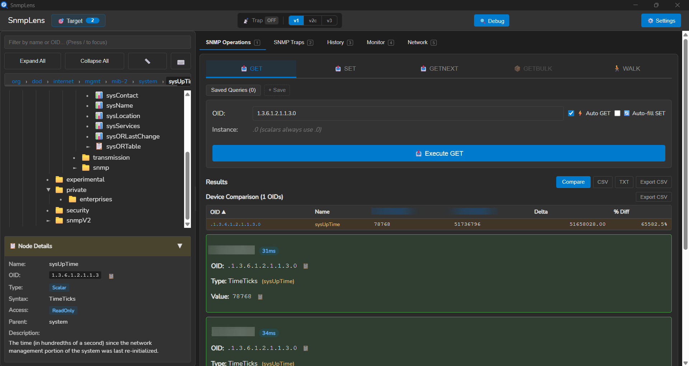
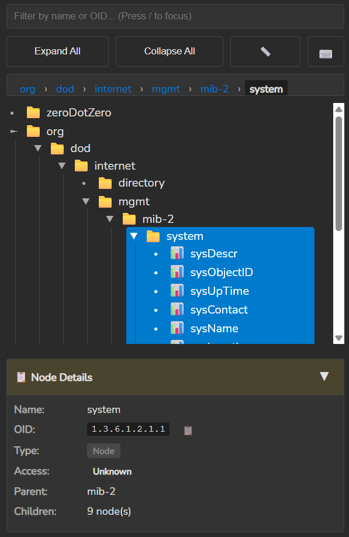
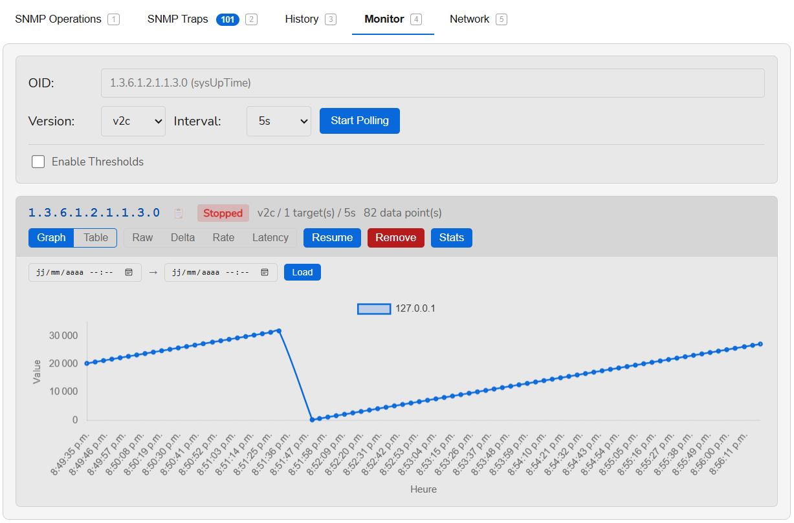
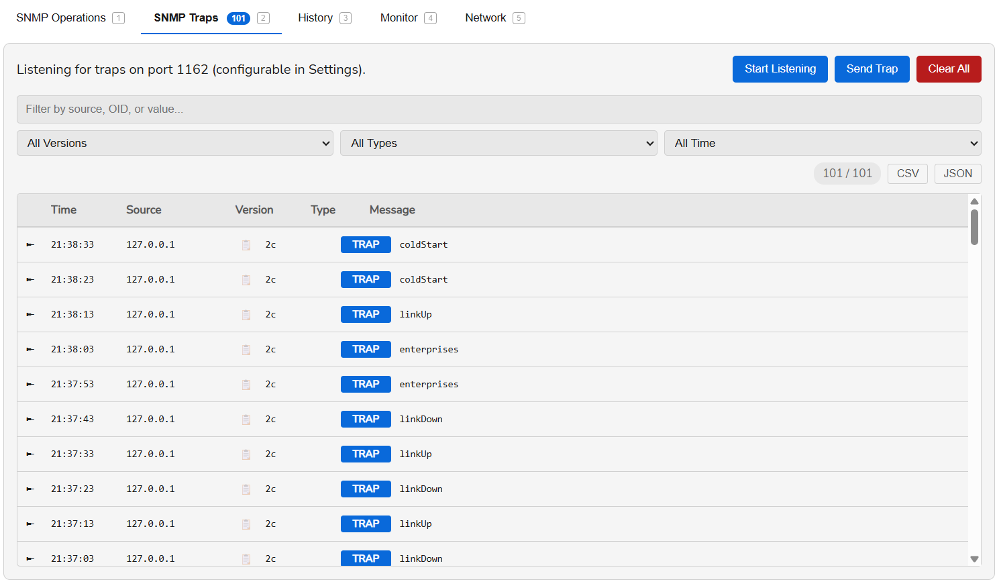
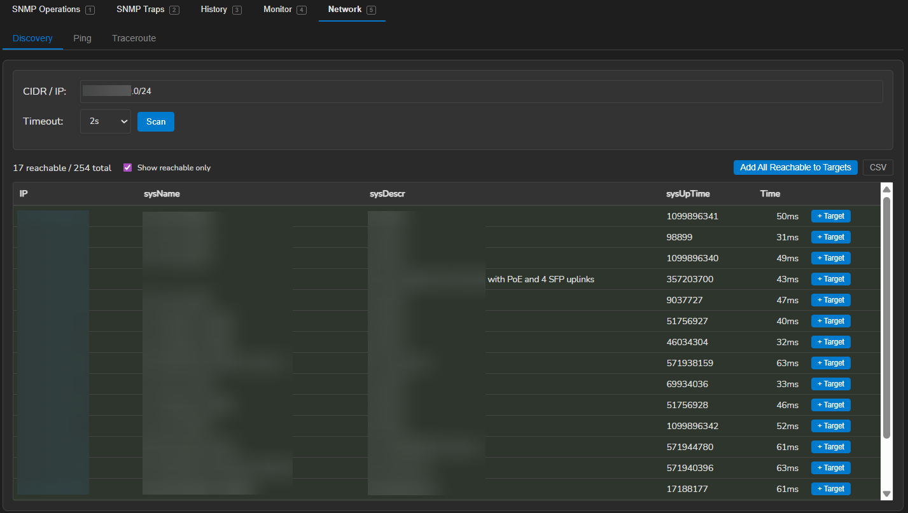
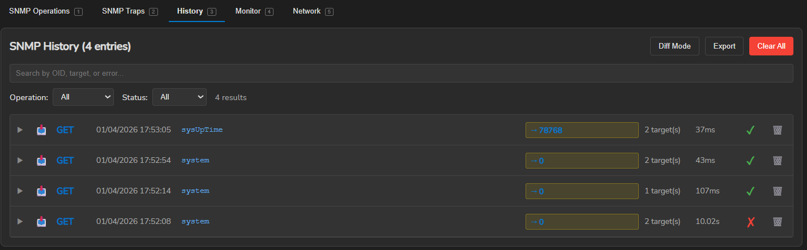
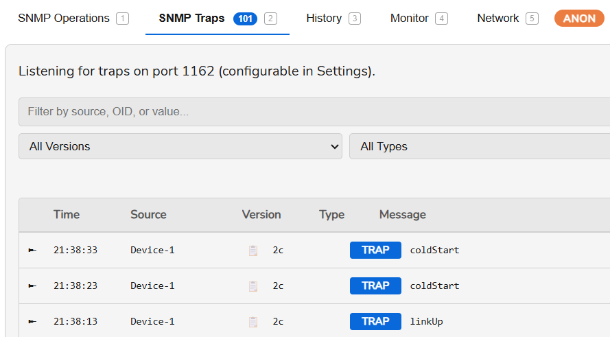
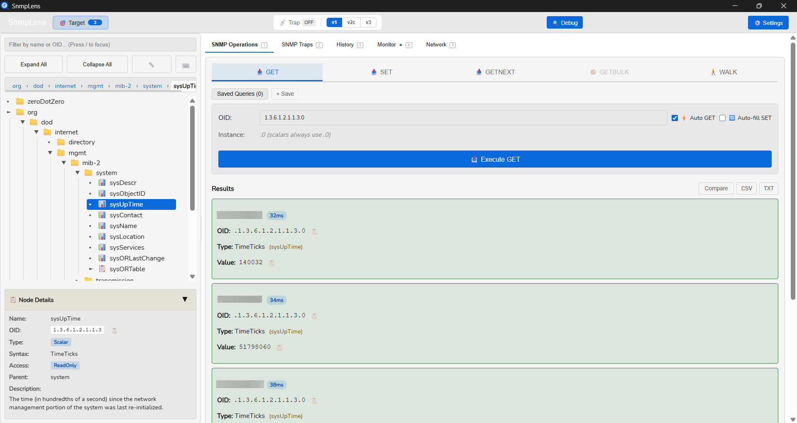

<p align="center">
  
</p>

<h1 align="center">SnmpLens</h1>

<p align="center">
  A modern, cross-platform SNMP MIB browser and network management desktop application.
  <br />
  Built with <a href="https://wails.io/">Wails</a> (Go + Svelte).
</p>

<p align="center">
  <a href="https://github.com/Wasabules/SnmpLens/actions/workflows/ci.yml"></a>
  <a href="https://github.com/Wasabules/SnmpLens/releases"></a>
  <a href="LICENSE"></a>
  
  
</p>

---

## Screenshots

<p align="center">
  
  <br /><em>SNMP Operations with Smart Table View</em>
</p>

<p align="center">
  
  <br /><em>Hierarchical MIB Tree Browser with search and favorites</em>
</p>

<p align="center">
  
  <br /><em>Real-time OID Monitoring with Chart.js graphs</em>
</p>

<p align="center">
  
  <br /><em>SNMP Trap Listener with filtering and export</em>
</p>

<p align="center">
  
  <br /><em>CIDR Network Discovery, Ping and Traceroute</em>
</p>

<p align="center">
  
  <br /><em>Query History with side-by-side diff comparison</em>
</p>

<p align="center">
  
  <br /><em>Anonymous Mode — sensitive data hidden for safe screenshots</em>
</p>

<p align="center">
  
  <br /><em>Light Theme</em>
</p>

---

## Features

### SNMP Operations

- **GET / SET / GETNEXT / GETBULK / WALK** with concurrent multi-target execution
- **Smart Table View** — auto-detects SNMP tables and renders structured columns with sorting and CSV export
- **Smart Value Formatting** — TimeTicks displayed as human-readable duration (e.g. `127d 3h 46m`), large numbers with thousand separators
- **Result Filtering** — regex-capable filter bar on WALK/GETBULK results to search across OIDs, names, types, and values
- **One-click Copy** — copy any OID, value, or target to clipboard with a single click
- **Device Comparison** — side-by-side multi-target comparison with delta and percentage differences
- **Double-click GET** — double-click any MIB tree node to instantly perform a GET operation
- **SNMPv3 Full Support** — authentication (MD5, SHA, SHA-256, SHA-512) and privacy (DES, AES, AES-256)
- **SNMP Debug** — live packet inspection with auto-refresh

### MIB Browser

- **Hierarchical Tree** navigation with collapsible nodes
- **Global Search** across name, OID, description, and syntax
- **Filter Chips** for dynamic filtering
- **Favorites** — bookmark frequently used OIDs
- **Node Details** panel with full OID metadata (syntax, access, status, description)
- **Custom MIBs** — load your own MIB files from a persistent directory
- **Drag & Drop Import** — drop MIB files or folders anywhere in the app to import them instantly. Supports recursive folder scanning, duplicate detection, and shows a detailed error report if any files fail to load

### Monitoring & Alerting

- **Real-time OID Polling** with interactive Chart.js graphs
- **Multiple View Modes** — raw values, delta, rate (per-second), and latency
- **Threshold Alerts** — configurable min/max with native OS notifications (Windows toast, macOS, Linux)
- **Session Management** — create, pause, resume, and delete monitoring sessions
- **Historical Data** — SQLite storage for long-term trending with time-range queries

### Trap Management

- **Trap Listener** — receive SNMPv1/v2c/v3 traps on configurable port
- **Trap Sender** — send custom traps for testing
- **Native OS Notifications** — Windows toast / macOS / Linux notifications with MIB-resolved trap names
- **Filtering & Export** — filter received traps and export to CSV

### Network Tools

- **CIDR Discovery** — scan IP ranges for SNMP-responsive devices
- **Ping** — cross-platform, no elevated privileges required (pure Go)
- **Traceroute** — hop-by-hop route tracing

### Query History

- Full operation history with timestamps and results
- **Diff Comparison** — side-by-side diff between any two query results
- **Saved Queries** — bookmark and re-run frequent queries

### Target Management

- Multiple targets with comma or newline separation
- **Target Groups** for organizing devices
- **Per-target Overrides** — custom SNMP version, community, port per device
- **Connection Testing** — verify reachability before operations

### Anonymous Mode

- **One-click privacy** — hide all sensitive data for safe screenshots and demos
- **Stable aliases** — IPs become `Device-1`, `Device-2`, etc. (consistent within a session)
- **Comprehensive masking** — covers IP addresses, community strings, SNMPv3 credentials, hostnames, device descriptions, trap sources, debug logs
- **Quick toggle** — `Ctrl+Shift+A` or checkbox in Settings > Privacy
- **Visual indicator** — pulsing `ANON` badge in the tab bar when active
- **Non-persistent** — automatically disabled on restart to prevent accidental data hiding

### UI / UX

- **Dark / Light Theme** with system detection or manual toggle
- **Anonymous Mode** — hide sensitive data (IPs, credentials) for screenshots (`Ctrl+Shift+A`)
- **Native Desktop Notifications** — configurable per feature (traps, monitoring alerts)
- **5 Languages** — English, French, German, Spanish, Chinese (auto-detected)
- **Resizable Panels** — adjustable MIB browser width (persisted)
- **Keyboard Shortcuts** — see table below
- **AES-256-GCM Encryption** for locally stored credentials

---

## Keyboard Shortcuts

| Shortcut          | Action                  |
| ----------------- | ----------------------- |
| `Ctrl + 1`        | Operations tab          |
| `Ctrl + 2`        | Traps tab               |
| `Ctrl + 3`        | History tab             |
| `Ctrl + 4`        | Monitor tab             |
| `Ctrl + 5`        | Network / Discovery tab |
| `Ctrl + ,`        | Open Settings           |
| `Ctrl + Shift + A` | Toggle Anonymous Mode  |
| `F5`              | Reload MIB files        |
| `Esc`             | Close modal             |

---

## Tech Stack

| Layer    | Technology                                                                 |
| -------- | -------------------------------------------------------------------------- |
| Framework | [Wails v2](https://wails.io/) — Go backend + Web frontend in one binary  |
| Backend  | Go 1.25 — [gosnmp](https://github.com/gosnmp/gosnmp), [gosmi](https://github.com/sleepinggenius2/gosmi), [SQLite](https://pkg.go.dev/modernc.org/sqlite), [pro-bing](https://github.com/prometheus-community/pro-bing) |
| Frontend | [Svelte 3](https://svelte.dev/) + [Vite](https://vitejs.dev/)             |
| Charts   | [Chart.js](https://www.chartjs.org/) with date-fns adapter                |
| i18n     | [svelte-i18n](https://github.com/kaisermann/svelte-i18n)                  |
| Database | SQLite (embedded, WAL mode)                                                |

---

## Build

### Prerequisites

| Requirement | Version |
| ----------- | ------- |
| [Go](https://go.dev/) | 1.25+ |
| [Node.js](https://nodejs.org/) | 18+ |
| [Wails CLI](https://wails.io/docs/gettingstarted/installation) | v2 |

**Linux only** — install GTK and WebKit development libraries:

```bash
sudo apt-get install -y libgtk-3-dev libwebkit2gtk-4.1-dev
```

### Development

```bash
wails dev
```

Starts a hot-reload development server with live frontend updates.

### Production

```bash
wails build
```

The compiled binary is output to `build/bin/`.

### Platform-Specific Builds

```bash
wails build -platform windows/amd64          # Windows
wails build -platform linux/amd64 -tags webkit2_41   # Linux
wails build -platform darwin/universal       # macOS (Intel + Apple Silicon)
```

---

## Architecture

```
SnmpLens
├── main.go / app.go          # Wails application entry point and bindings
├── pkg/
│   ├── mib/                   # MIB loading and tree construction (gosmi)
│   ├── snmp/                  # SNMP client, operations, traps, discovery
│   ├── network/               # Ping and traceroute tools
│   └── storage/               # SQLite persistence for monitoring data
├── mibs/                      # Bundled standard SNMPv2 MIB files
└── frontend/
    └── src/
        ├── App.svelte         # Main layout with tabbed navigation
        ├── MibPanel.svelte    # MIB tree browser
        ├── OperationsPanel    # SNMP operations UI
        ├── MonitorPanel       # Real-time polling and charts
        ├── TrapPanel          # Trap listener/sender
        ├── DiscoveryPanel     # Network tools
        ├── HistoryPanel       # Query history and diff
        ├── stores/            # Svelte stores (state management)
        ├── utils/             # Helpers (crypto, CSV, formatting)
        └── i18n/              # Translation files (en, fr, de, es, zh)
```

The Go backend exposes methods to the frontend via [Wails bindings](https://wails.io/docs/howdoesitwork). SNMP operations run concurrently using goroutines for multi-target execution. Monitoring data is persisted in an embedded SQLite database with WAL mode. Sensitive credentials are encrypted with AES-256-GCM in the browser's localStorage.

---

## Configuration

Configuration is managed through the in-app **Settings** dialog (`Ctrl + ,`):

- **SNMP** — default version, community string, port, timeout, retries, SNMPv3 credentials
- **Monitoring** — data retention period, auto-resume sessions, desktop notifications, alert sounds
- **MIBs** — manage MIB file directories, load custom MIBs
- **UI** — theme (dark/light/system), language, auto-GET on node selection

MIB files and the monitoring database are stored in the user config directory:

| OS      | Path                              |
| ------- | --------------------------------- |
| Windows | `%APPDATA%\SnmpLens\`             |
| macOS   | `~/.config/SnmpLens/`             |
| Linux   | `~/.config/SnmpLens/`             |

---

## Test Agent

A built-in Python SNMP agent simulator is provided in `tools/snmp_test_agent.py` for testing without real network equipment. It requires no external dependencies beyond `pycryptodome` (for SNMPv3 AES).

```bash
pip install pycryptodome
python tools/snmp_test_agent.py --trap-port 1162 --trap-interval 10
```

### Features

- Pure Python — no pysnmp dependency, works on Python 3.10+
- SNMPv1, v2c, and full v3 support (discovery, authentication, encryption)
- 5 simulated interfaces with dynamic traffic counters
- Realistic OIDs: system, ifTable, ifXTable, IP, SNMP stats, hrSystem, hrStorage
- Periodic trap sending (v2c and v3) with linkDown, linkUp, coldStart, customAlert
- Recursive folder import support

### Credentials

| Version | User | Auth | Priv |
| ------- | ---- | ---- | ---- |
| v1/v2c | — | community `public` | — |
| v3 | `snmplens` | SHA / `authpass123` | AES-128 / `privpass123` |
| v3 | `sha256user` | SHA-256 / `authpass123` | AES-128 / `privpass123` |
| v3 | `sha512user` | SHA-512 / `authpass123` | AES-256 / `privpass123` |
| v3 | `authonly` | SHA / `authpass123` | — |
| v3 | `noauthuser` | — | — |

---

## License

[MIT](LICENSE) — Geoffrey Lecoq
