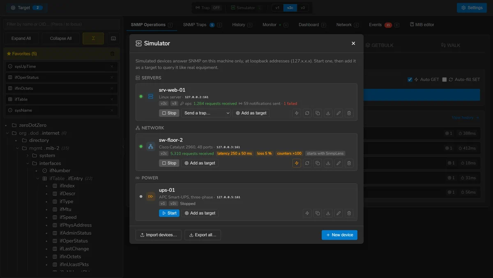
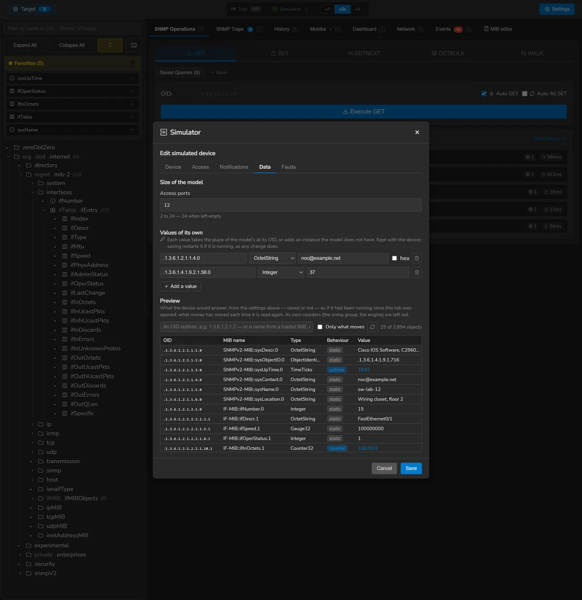
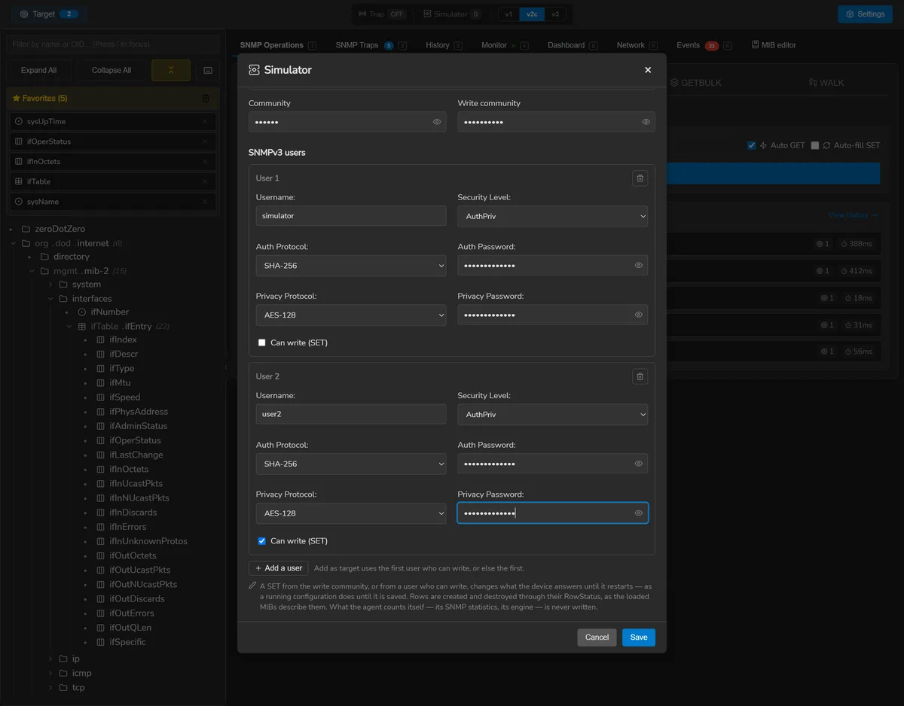
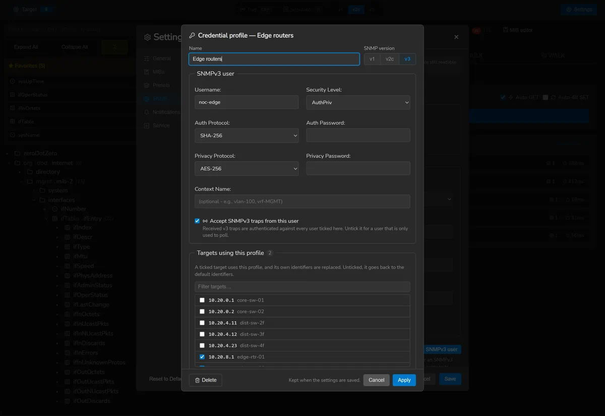

<p align="center">
  
</p>

<h1 align="center">SnmpLens</h1>

<p align="center">
  A modern, cross-platform SNMP MIB browser, MIB editor and monitoring desktop application —
  dashboards drawn from shareable presets, a trap receiver, and alerts routed to syslog, a webhook or email.
  <br />
  One native binary, built with <a href="https://wails.io/">Wails</a> (Go + Svelte).
</p>

<p align="center">
  <a href="https://snmplens.com/"><strong>Website</strong></a>
  &nbsp;·&nbsp;
  <a href="https://snmplens.com/demo.html"><strong>Try it in your browser</strong></a>
  &nbsp;·&nbsp;
  <a href="https://snmplens.com/documentation.html">Documentation</a>
  &nbsp;·&nbsp;
  <a href="https://snmplens.com/download.html">Download</a>
</p>

<p align="center">
  <a href="https://github.com/Wasabules/SnmpLens/actions/workflows/ci.yml"></a>
  <a href="https://github.com/Wasabules/SnmpLens/releases"></a>
  <a href="LICENSE"></a>
  
  
</p>

---

## Guides

- [Try it without a device](#try-it-without-a-device) — a simulated server or switch on this machine, in two minutes
- [Credential profiles](#credential-profiles) — named SNMP identifiers, given to targets instead of the defaults
- [Writing a dashboard preset](#writing-a-dashboard-preset) — what to poll on one kind of equipment, and how to draw it
- [Message templates](#message-templates) — the subject and body an alert is sent with
- [Adding MIBs](#adding-mibs) — importing, enabling, diagnosing and editing MIB modules
- [Simulated devices](#simulated-devices) and [custom simulator models](#custom-simulator-models) — the simulator in full
- [Configuration](#configuration) — the settings, and every file SnmpLens writes

The same, with screenshots, is on the [documentation site](https://snmplens.com/documentation.html).

---

## Screenshots

<p align="center">
  
  <br /><em>SNMP Operations — a walk of <code>ifTable</code> pivoted into columns and split by INDEX</em>
</p>

<table>
  <tr>
    <td width="50%"><br /><em>A dashboard drawn from a preset: tiles, a chart, a wall of port states and a map of the rack</em></td>
    <td width="50%"><br /><em>One preset drawn across two switches of different sizes</em></td>
  </tr>
  <tr>
    <td width="50%"><br /><em>The MIB tree, searchable across name, OID, description and syntax</em></td>
    <td width="50%"><br /><em>The MIB editor, reporting an unknown type and a duplicated OID by line and column</em></td>
  </tr>
  <tr>
    <td width="50%"><br /><em>Polling sessions charted as values, deltas, rates or latency</em></td>
    <td width="50%"><br /><em>The event journal — traps, thresholds, reachability, and deliveries that failed</em></td>
  </tr>
  <tr>
    <td width="50%"><br /><em>Alert routing: destinations, rules and the delivery log</em></td>
    <td width="50%"><br /><em>Received traps, with the trap OID resolved through your MIBs</em></td>
  </tr>
  <tr>
    <td width="50%"><br /><em>CIDR discovery, then ping and traceroute without elevated privileges</em></td>
    <td width="50%"><br /><em>Two walks of the same device, diffed</em></td>
  </tr>
  <tr>
    <td width="50%"><br /><em>Anonymous Mode — addresses and credentials masked for safe screenshots</em></td>
    <td width="50%"><br /><em>Light theme</em></td>
  </tr>
  <tr>
    <td width="50%"><br /><em>Simulated devices on this machine: a server sending traps, a switch made to misbehave, a UPS</em></td>
    <td width="50%"><br /><em>A simulated switch given twelve ports and values of its own, and a live preview named from the MIBs</em></td>
  </tr>
  <tr>
    <td width="50%"><br /><em>Who may read and write a simulated device: communities, and SNMPv3 users allowed to SET or not</em></td>
    <td width="50%"><br /><em>A credential profile: an SNMPv3 user, the targets given it, and a test</em></td>
  </tr>
</table>

---

## Features

### SNMP Operations

- **GET / SET / GETNEXT / GETBULK / WALK** with concurrent multi-target execution
- **Conceptual tables** — a walk is pivoted into columns and split by INDEX following RFC 2578 §7.7, so `tcpConnTable` reads as four index fields instead of one opaque sub-OID, name-keyed tables show names, and rows sort numerically. Sortable, filterable, exportable to CSV
- **Row creation and deletion** on tables that define a `RowStatus` column, written as one atomic SET so the agent never sees a half-built row
- **Smart Value Formatting** — TimeTicks as a readable duration (e.g. `127d 3h 46m`), enumerations as `ethernetCsmacd(6)`, large numbers with thousand separators
- **Result Filtering** — regex-capable filter bar on WALK/GETBULK results to search across OIDs, names, types, and values
- **One-click Copy** — copy any OID, value, or target to clipboard with a single click
- **Device Comparison** — side-by-side multi-target comparison with delta and percentage differences
- **Double-click GET** — double-click any MIB tree node to instantly perform a GET operation
- **SNMPv3 Full Support** — authentication (MD5, SHA, SHA-256, SHA-512) and privacy (DES, AES, AES-256)
- **IPv6** — targets, the trap listener and traceroute, including link-local addresses with a zone
- **SNMP Debug** — live packet inspection, with community strings and passphrases scrubbed from the log

### Dashboards & Presets (`Ctrl + 8`)

- **Presets** — small JSON files describing what to poll on one kind of equipment and how to draw it. Meant to be shared: a preset picks from a fixed vocabulary of widgets and cannot carry anything that executes
- **Preset library** — *Settings → Presets*: add a preset by file or by dropping it on the window. A preset with problems is kept and listed with them, and cannot be bound until they are fixed
- **Cost stated before binding** — OIDs, cadence, requests and values a day, how many readings carry a threshold and how many of those can raise an incident
- **Device detection** — asks an equipment for its `sysObjectID` and puts the presets written for it first
- **Discovery at bind time** — a widget can name a column to walk instead of listing its instances, so one preset fits a 24-port switch and a 48-port chassis, with every port named the way the equipment names it
- **Layout** — widgets placed on a twelve-column grid, collapsing to one column on a narrow window
- **Thresholds carried by the preset** — materialised into the monitoring session when it is bound, and editable afterwards like any other
- **Six widget kinds** — latest value, per-second rate, chart, state tile, grid of states (a switch's port panel), and a **map**
- **Maps** — boxes, lines, labels and dots bound to OIDs and coloured by what each reading is doing, drawn over a picture of your rack or site. Backgrounds are yours: PNG, JPEG or GIF, checked by decoding them; SVG is deliberately refused
- **Several equipments on one dashboard** — one monitoring session per equipment, drawn together as a group
- **A snapshot, not a link** — editing or deleting a preset never changes a dashboard already bound; binding again adopts the new version
- **Six example presets** — IF-MIB interfaces, switch ports, Cisco, a HOST-RESOURCES server, a UPS (RFC 1628), and a 24-port switch drawn as its front panel

### Simulator

- **Simulated devices on this machine** — SNMP agents on loopback addresses, answering v1, v2c and v3 (the whole USM) from fourteen models: Linux and Windows servers, an iDRAC, Catalyst switches, a router, a MikroTik, a FortiGate, a UniFi access point, a Synology NAS, UPSs, a rack PDU, a printer and an environment probe
- **A whole agent's walk** — IF-MIB, IP, TCP, UDP, ENTITY, BRIDGE, LLDP, HOST-RESOURCES, UCD and each vendor's own MIBs, agreeing with each other, with counters that move and wrap
- **Notifications** — traps and INFORMs in every version, to SnmpLens or anywhere on the network: at boot, on a refused request, on a schedule, or on demand
- **Writable** — a write community, or SNMPv3 users allowed to SET; `RowStatus` rows created and destroyed as the loaded MIBs describe them
- **Faults** — latency, loss, a device that goes silent, `genErr` or `tooBig`, and counters running up to 1000× faster
- **Shaped data** — a model's size (ports, disks, outlets, processors), values of its own OID by OID, and a live preview of what it answers
- **Your own models** — a JSON file, a package carrying recorded walks, or a real device recorded from SnmpLens
- **A bench as a file** — devices exported with or without their passwords, and imported on another machine

### MIB Browser

- **Hierarchical Tree** navigation with collapsible nodes
- **Global Search** across name, OID, description, and syntax
- **Filter Chips** for dynamic filtering
- **Favorites** — bookmark frequently used OIDs
- **Node Details** panel with full OID metadata (syntax, access, status, units, parent, description)
- **Custom MIBs** — load your own MIB files from a persistent directory, and switch any module off
- **Drag & Drop Import** — drop MIB files or folders anywhere in the app. Recursive folder scanning and duplicate detection
- **Why a MIB did not load** — the stage it reached, the line and column with an excerpt, the imports that could not be satisfied and the symbols each was needed for, and a plain answer for the files people download by mistake (an HTML page, a PDF, a zip, UTF-16)
- **Dependency tree** — *Settings → MIBs* shows what imports what, which modules are missing, and which symbols they were needed for

### MIB Editor (`Ctrl + 7`)

- **Syntax highlighting**, find and replace (`Ctrl + F`), undo and redo grouped by edit rather than by keystroke
- **Three kinds of checking** — syntax errors with line and column as you type, whether the module loads, and a semantic pass on a pause that catches what loading does not: unknown types, duplicate OIDs, unresolved parents, missing modules in `FROM`, undefined `INDEX` objects
- **Fix imports** — works out which symbol comes from which module and edits the IMPORTS clause as text, so comments and alignment survive
- **Outline** — every definition in the file with its kind, syntax, access and status, filterable, and still there above a syntax error
- **Safe to use on standard MIBs** — bundled MIBs are backed up before they are overwritten, can be restored to the shipped version, and the tree is health-checked after a reload. Unsaved work survives closing the window

### Monitoring

- **Real-time OID Polling** with interactive Chart.js graphs
- **Multiple View Modes** — raw values, delta, rate (per-second), and latency. Counter wraps are corrected, and rates derived from the time that actually elapsed
- **Threshold Alerts** — a minimum, a maximum and how long it must be breached for. A value oscillating around its threshold is one incident, not forty; a device that stops answering is its own kind of incident
- **Runs in the background** — the poll clock lives in the Go backend, so sessions, thresholds and alerts keep running with the window closed. Tray icon, start at login (per-user, never asks for elevation), and sessions resumed at startup
- **Overload guardrail** — when a round no longer fits inside its cadence, the session widens its own period and says so, instead of polling the device flat out. *Keep my cadence* overrides it
- **Session Management** — create, pause, resume, and delete monitoring sessions
- **Historical Data** — SQLite storage for long-term trending with time-range queries

### Events & Alert Routing (`Ctrl + 6`)

- **Event journal** — traps, threshold episodes opened and resolved, devices that stopped answering, deliveries that failed. Filterable and exportable
- **Routing rules** — match on category, severity, source and OID prefix, with priorities, a "stop here" flag and quiet hours in your own timezone
- **Destinations** — syslog (UDP, TCP, or TLS per RFC 5425, with mutual TLS), webhook (bearer token, custom headers), and email (implicit TLS or STARTTLS). Each accepts a CA certificate, so an internal collector can be trusted without turning verification off
- **Message templates** — per destination, over a fixed list of variables. A webhook can send its own JSON — which is how you talk to Slack, Teams or Alertmanager — with a preview rendered by the same code that sends it
- **Durable outbox** — deliveries survive a closed window or an unreachable relay, with retries and backoff. A delivery log shows what was sent, what is waiting, and what was given up on, with a retry button

### Trap Management

- **Trap Listener** — receive SNMPv1/v2c/v3 traps and acknowledged INFORMs on a configurable port
- **Built for storms** — an 8 MiB receive buffer; measured with no loss at 2000 traps per second sustained
- **Trap Sender** — send traps, or INFORMs to check a receiver acknowledges them (refused on v1, which has no such PDU)
- **Native OS Notifications** — Windows toast / macOS / Linux notifications with MIB-resolved trap names
- **Filtering & Export** — filter received traps and export to CSV

### Network Tools

- **CIDR Discovery** — scan IP ranges for SNMP-responsive devices
- **Ping** — cross-platform, no elevated privileges required (pure Go)
- **Traceroute** — hop-by-hop route tracing, over IPv4 or IPv6

### Query History

- Full operation history with timestamps and results
- **Diff Comparison** — side-by-side diff between any two query results
- **Saved Queries** — bookmark and re-run frequent queries

### Target Management

- Multiple targets with comma or newline separation
- **Target Groups** for organizing devices
- **Labels** — a device's label appears in operations, traps, history and events, with the address on hover
- **Per-target Overrides** — custom SNMP version, community, port per device
- **Credential profiles** — named communities and SNMPv3 users, each with its version, given to targets instead of the defaults — see [the guide](#credential-profiles)
- **Connection Testing** — verify reachability before operations
- **Bind a preset** — choose a dashboard preset when you add an equipment, or bind one later

### Anonymous Mode

- **One-click privacy** — hide all sensitive data for safe screenshots and demos
- **Stable aliases** — IPs become `Device-1`, `Device-2`, etc. (consistent within a session)
- **Comprehensive masking** — covers IP addresses, community strings, SNMPv3 credentials, hostnames, device descriptions, trap sources, debug logs
- **Quick toggle** — `Ctrl+Shift+A` or the checkbox in *Settings → General*
- **Visual indicator** — pulsing `ANON` badge in the tab bar when active
- **Non-persistent** — automatically disabled on restart to prevent accidental data hiding

### Security

- **Credentials held by the operating system** — the community string and SNMPv3 passphrases are sealed with a key kept by DPAPI on Windows, the Keychain on macOS, or a protected file on Linux, rather than stored beside the ciphertext
- **Signed updates** — an Ed25519-signed checksum manifest, bound to its release tag, verified before anything is applied; build provenance is attested
- **Content from the network is escaped** for every protocol it is written into — SMTP, mail headers, the syslog header — and exported CSV neutralises cells that a spreadsheet would run as a formula
- **Presets cannot execute anything** — a fixed widget and shape vocabulary, numeric OIDs only, no SVG, and map backgrounds named rather than carried

See the [security policy](SECURITY.md) for how to report a vulnerability.

### UI / UX

- **Dark / Light Theme** with system detection or manual toggle
- **Native Desktop Notifications** — configurable per feature (traps, monitoring alerts)
- **5 Languages** — English, French, German, Spanish, Chinese (auto-detected)
- **Resizable Panels** — adjustable MIB browser width (persisted)
- **Keyboard Shortcuts** — see table below
- **Browser demo** — the real interface on fixed data, at [snmplens.com/demo.html](https://snmplens.com/demo.html)

---

## Keyboard Shortcuts

| Shortcut           | Action                                  |
| ------------------ | --------------------------------------- |
| `Ctrl + 1`         | Operations tab                          |
| `Ctrl + 2`         | Traps tab                               |
| `Ctrl + 3`         | History tab                             |
| `Ctrl + 4`         | Monitor tab                             |
| `Ctrl + 5`         | Network / Discovery tab                 |
| `Ctrl + 6`         | Events tab                              |
| `Ctrl + 7`         | MIB editor tab                          |
| `Ctrl + 8`         | Dashboard tab                           |
| `Ctrl + ,`         | Open Settings                           |
| `Ctrl + B`         | Show or hide the MIB panel              |
| `Ctrl + Shift + A` | Toggle Anonymous Mode                   |
| `Ctrl + F`         | Find and replace, in the MIB editor     |
| `F5`               | Reload MIB files                        |
| `Esc`              | Close the open dialog                   |

On macOS these use the Control key, not Command — except find and replace in the MIB editor, which accepts either.

---

## Tech Stack

| Layer    | Technology                                                                 |
| -------- | -------------------------------------------------------------------------- |
| Framework | [Wails v2](https://wails.io/) — Go backend + Web frontend in one binary  |
| Backend  | Go 1.26 — [gosnmp](https://github.com/gosnmp/gosnmp), [gosmi](https://github.com/sleepinggenius2/gosmi), [SQLite](https://pkg.go.dev/modernc.org/sqlite), [pro-bing](https://github.com/prometheus-community/pro-bing) |
| Frontend | [Svelte 5](https://svelte.dev/) + [Vite 8](https://vitejs.dev/)          |
| Charts   | [Chart.js](https://www.chartjs.org/) with date-fns adapter                |
| i18n     | [svelte-i18n](https://github.com/kaisermann/svelte-i18n)                  |
| Database | SQLite (embedded, WAL mode)                                                |
| Credentials | Key held by DPAPI (Windows), the Keychain (macOS) or a protected file (Linux) |

---

## Build

### Prerequisites

| Requirement | Version |
| ----------- | ------- |
| [Go](https://go.dev/) | 1.26+ |
| [Node.js](https://nodejs.org/) | 20.19+ or 22.12+ (what Vite 8 requires) |
| [Wails CLI](https://wails.io/docs/gettingstarted/installation) | v2 |

**Linux only** — install GTK and WebKit development libraries:

```bash
sudo apt-get install -y libgtk-3-dev libwebkit2gtk-4.1-dev
```

### Development

```bash
wails dev
```

Starts a hot-reload development server with live frontend updates.

### Production

```bash
wails build
```

The compiled binary is output to `build/bin/`.

### Platform-Specific Builds

```bash
wails build -platform windows/amd64          # Windows
wails build -platform linux/amd64 -tags webkit2_41   # Linux
wails build -platform darwin/universal       # macOS (Intel + Apple Silicon)
```

---

## Auto-Update

SnmpLens updates itself from GitHub Releases. On startup (and via **Settings → General → Updates → Check now**) it queries the latest release and, if a newer version exists, shows a banner with the release notes.

**Applying an update** depends on how the app was installed:

| Platform / install | Action |
| --- | --- |
| Windows (installer) | downloads and runs `SnmpLens-windows-amd64-setup.exe`, then relaunches |
| Windows / Linux (portable binary) | replaces the running executable in place, then relaunches |
| macOS, Linux `.deb` | opens the download in the browser (manual install) |

The running version is embedded at build time via ldflags; local (`wails build`) builds report `dev`, which disables the update check.

### Release integrity & authenticity

Every release includes `SnmpLens-checksums.txt` (SHA-256 of all assets) and its Ed25519 signature `SnmpLens-checksums.txt.sig`. Before applying an update the app verifies the signature against the public key embedded in `pkg/updater/verify.go`, then verifies the asset's SHA-256 against the now-authenticated manifest — the "signed manifest" model Linux package repositories use.

- **Signing is mandatory.** The release workflow fails when the key is missing, rather than publishing a release every installed copy would refuse.
- **The manifest names its tag** on its first line (`version v1.2.3`), so an older signed manifest cannot be replayed to install a previous, possibly vulnerable, release.
- **Build provenance is attested**, and can be checked without trusting this repository:

  ```bash
  gh attestation verify SnmpLens-windows-amd64.exe --repo Wasabules/SnmpLens
  ```

**Rotating the signing key:**

```bash
go run ./tools/updatersign keygen
```

1. Paste the printed **public key** into `pkg/updater/verify.go` (`updaterPublicKey`).
2. Store the printed **private key** as the `UPDATER_PRIVATE_KEY` secret of the `release` environment (*Settings → Environments → release*). That environment should carry a protection rule — a required reviewer or a tag policy — so a run has to be admitted before the key is handed to it.

Rotation is not seamless: copies already installed trust only the public key they were built with, so they refuse updates signed with a new key and have to be updated by hand once.

---

## Architecture

```
SnmpLens
├── main.go                     # Wails entry point: the embedded files, handed to internal/app
├── internal/app/               # The methods the frontend calls, one file per feature
├── pkg/
│   ├── snmp/                   # SNMP client: operations, walks, traps and informs, discovery
│   ├── simulator/              # Simulated SNMP agents: v1/v2c/v3, models, notifications, recordings
│   ├── mib/                    # MIB loading (gosmi), diagnostics, editor analysis, dependency graph
│   ├── monitor/                # The poll clock, threshold episodes, counter wraps, overload guardrail
│   ├── preset/                 # Dashboard presets: validation, cost, discovery, layout, thresholds, maps
│   ├── imagegate/              # The decode check a map background has to pass
│   ├── events/                 # The event journal vocabulary
│   ├── notify/                 # Alert routing: syslog, webhook, email, templates, durable outbox
│   ├── storage/                # SQLite (WAL): history, sessions, events, rules, outbox
│   ├── secrets/                # Credential store held by the operating system
│   ├── updater/                # Signed-manifest auto-update
│   ├── service/ tray/ autostart/  # Background operation: early preferences, tray icon, login entry
│   ├── network/                # Pure-Go ping and traceroute
│   └── netaddr/                # Address handling shared by snmp and network (IPv6, zones)
├── mibs/                       # Bundled standard MIBs, extracted on first run
├── presets/                    # Example dashboard presets, extracted on first run
└── frontend/src/
    ├── App.svelte              # Tabbed shell, shortcuts, resizable MIB panel, file drop
    ├── MibPanel.svelte         # MIB tree browser
    ├── OperationsPanel.svelte  # SNMP operations and conceptual tables
    ├── TrapPanel.svelte        # Trap and inform listener and sender
    ├── HistoryPanel.svelte     # Query history and diff
    ├── MonitorPanel.svelte     # Polling sessions and charts
    ├── DashboardPanel.svelte   # Dashboards drawn from presets
    ├── DiscoveryPanel.svelte   # CIDR discovery, ping, traceroute
    ├── EventsPanel.svelte      # Event journal
    ├── MibEditorPanel.svelte   # MIB editor
    ├── SettingsModal.svelte    # Settings dialog; each section lives in settings/
    ├── stores/                 # Svelte stores (state management)
    ├── utils/                  # Helpers (CSV, formatting, layout, dashboard grouping…)
    └── i18n/                   # Translation files (en, fr, de, es, zh)
```

The Go backend exposes methods to the frontend via [Wails bindings](https://wails.io/docs/howdoesitwork). SNMP operations run concurrently using goroutines for multi-target execution. Monitoring runs in Go, one goroutine per session, so it keeps going with the window closed. Data is persisted in an embedded SQLite database with WAL mode. Credentials are sealed with a key held by the operating system, which the frontend never sees.

The reasoning behind the less obvious decisions — and the measurements that settled them — is written down in [CLAUDE.md](CLAUDE.md).

---

## Configuration

Everything is set in the in-app **Settings** dialog (`Ctrl + ,`), in six sections:

- **General** — theme, language, SNMP timeout and retries, confirmation before a SET, data retention, notifications, update checks, Anonymous Mode
- **MIBs** — the MIB directory, which modules are loaded, missing dependencies and the dependency tree
- **Presets** — the dashboard preset library, what each one costs, and map backgrounds
- **SNMP** — default community, SNMPv3 credentials, and a connection test
- **Notifications** — alert destinations, routing rules, message templates and the delivery log
- **Service** — background operation, start at login, what to resume at startup, and the SET audit

Everything SnmpLens writes lives in the user config directory:

| OS      | Path                              |
| ------- | --------------------------------- |
| Windows | `%APPDATA%\SnmpLens\`             |
| macOS   | `~/.config/SnmpLens/`             |
| Linux   | `~/.config/SnmpLens/`             |

| Item            | Contents                                                         |
| --------------- | ---------------------------------------------------------------- |
| `mibs/`         | The bundled MIBs, extracted on first run, plus everything you add |
| `presets/`      | Dashboard presets                                                |
| `assets/`       | Map backgrounds                                                  |
| `mib-backups/`  | Backups taken before a bundled MIB is overwritten                |
| `mib-drafts/`   | Unsaved MIB editor buffers                                       |
| `monitoring.db` | SQLite: history, events, sessions, rules, destinations, outbox   |
| `service.json`  | The few preferences read before the window exists                |
| `simulator.json` | Simulated devices (their passwords are in the system keychain)  |
| `simulator-models/` | Custom simulator models, and their icons                     |

---

## Try It Without a Device

SnmpLens carries its own SNMP agents, so everything in this README can be tried against devices running on your own machine — nothing to install and no equipment to touch.

1. Click **Simulator** in the header, then **New device**.
2. Pick a model — the Linux server comes first — and keep the address SnmpLens suggests: a loopback address of the device's own, such as `127.0.0.2`. Loopback is the only kind of address a simulated device may answer on.
3. **Save**, then **Start**. The device answers v2c with the community `public` until you give it other identifiers in the editor's **Access** tab.
4. **Add as target** puts it in your target list, with its port and its identifiers, in the most secure version it answers.
5. In **Operations** (`Ctrl + 1`), pick `ifTable` in the MIB tree and **WALK** it.

To see notifications arrive, start the listener in the **Traps** tab (`Ctrl + 2`), give the device a destination in its **Notifications** tab — a new one is SnmpLens on this machine, at the listener's port — and send any of its notifications from its menu in the list. The **Data** tab previews everything the device answers, before it is even started.

macOS answers on `127.0.0.1` alone unless aliases are added, so there devices are told apart by port: `127.0.0.1:1161` is a target of its own. The rest of the simulator — faults, writing, bench files, your own models — is under [Simulated devices](#simulated-devices).

---

## Credential Profiles

A **credential profile** is a named set of SNMP identifiers that targets are given instead of the defaults: a community for v1 or v2c, or an SNMPv3 user — name, security level, protocols and passphrases. A profile carries its SNMP version, because "this switch speaks v3 as `ops-ro`" is one statement.

**Creating one.** *Settings → SNMP → Credential profiles*, then **Community profile** or **SNMPv3 user**. Name it, fill in the identifiers, and tick the targets that use it under **Targets using this profile**. **Test these identifiers** tries them against one of your targets first; **Apply** keeps the profile, and saving the settings stores it.

**From a target.** A target that has identifiers of its own can turn them into a profile: in its overrides, **Save as a profile** creates one and gives it to the target.

**Which identifiers a target uses** comes from exactly one place, in this order:

1. its profile, when it has one — a profile *replaces* the target's own identifiers rather than being layered under them;
2. otherwise its own overrides — a community, a version, an SNMPv3 user;
3. otherwise the default identifiers (*Settings → SNMP*), in the version chosen in the header.

Transport stays per target: the port, the timeout and the retries are never part of a profile. Deleting a profile sends its targets back to the default identifiers.

**Monitoring follows.** A monitoring session keeps the identifiers it was started with, and it is updated when the profile they came from changes: a rotated passphrase reaches every session built from the profile when the settings are saved, with nothing to rebind. Polling several targets that do not authenticate the same way starts one session per set of identifiers, and says so.

**Traps.** The trap listener authenticates received SNMPv3 notifications against the default user and every SNMPv3 profile at once — except those whose **Accept SNMPv3 traps from this user** is unticked, for a user only used to poll. The **Traps** tab lists who is heard, and marks a user the listener refused with the reason. v1 and v2c notifications are received whatever their community: there is nothing to accept or refuse.

**Where they are kept.** Communities and passphrases are sealed with a key the operating system holds — DPAPI on Windows, the Keychain on macOS, a file only your account can read on Linux — each profile's under its own ID, so renaming or reordering profiles never mixes them up. A profile still on MD5 or DES is flagged as using weak algorithms.

---

## Writing a Dashboard Preset

A **preset** is one JSON file describing what to poll on one kind of equipment and how to draw it. It picks from a fixed vocabulary — six widget kinds, four map shapes, numeric OIDs — and cannot describe anything of its own, which is what makes a preset written by someone else safe to open. The six examples SnmpLens writes out on first run are in [`presets/`](presets/); reading one is the quickest way to start your own.

This one watches an access switch: two tiles on the left, a wall of its ports — discovered when it is bound — beside them, and the uplink traffic across the bottom.

```json
{
  "formatVersion": 1,
  "name": "Access switch",
  "author": "you",
  "description": "Port states and uplink traffic. The ports are discovered when you bind it.",
  "match": { "vendor": "Cisco", "sysObjectIdPrefix": ["1.3.6.1.4.1.9"] },
  "intervalSec": 60,
  "widgets": [
    { "kind": "value", "title": "Uptime", "oids": ["1.3.6.1.2.1.1.3.0"],
      "layout": { "x": 0, "y": 0, "w": 3 } },
    { "kind": "value", "title": "Interfaces", "oids": ["1.3.6.1.2.1.2.1.0"],
      "layout": { "x": 0, "y": 1, "w": 3 } },
    { "kind": "grid", "title": "Ports",
      "oids": ["1.3.6.1.2.1.2.2.1.8.{#}"],
      "discover": { "walk": "1.3.6.1.2.1.2.2.1.2" },
      "labels": { "1": "up", "2": "down" },
      "layout": { "x": 3, "y": 0, "w": 9, "h": 2 } },
    { "kind": "chart", "title": "Uplink traffic", "unit": "bit/s",
      "oids": ["1.3.6.1.2.1.2.2.1.10.1", "1.3.6.1.2.1.2.2.1.16.1"],
      "layout": { "x": 0, "y": 2, "w": 12, "h": 2 } }
  ]
}
```

| Field | Required | What it is |
| ----- | -------- | ---------- |
| `formatVersion` | yes | Always `1`. A file from a newer version is refused with a sentence rather than misread |
| `name` | yes | What the library shows, up to 120 characters |
| `author`, `description` | no | The description can run to 600 characters |
| `match` | no | `vendor` and `sysObjectIdPrefix`: the equipment it is written for, which **Detect** uses to put it first |
| `intervalSec` | yes | How often to poll, from 5 to 86400 seconds |
| `widgets` | yes | From 1 to 40 of them |

### Widgets

| Field | What it is |
| ----- | ---------- |
| `kind` | One of the six below |
| `title`, `unit` | What the widget is called, and what its readings are in — `bit/s`, `%` |
| `oids` | Numeric OIDs, never names — at most 500 across the whole preset |
| `labels` | A state number to a word, for `status`, `grid` and `map`: `{"1": "up", "2": "down"}` |
| `discover` | `walk`, the column to walk, and optionally `max`; the OIDs then carry `{#}` where the instance goes |
| `layout` | `x` 0–11, `y` 0–64, `w` 1–12 and `h` 1–12, in cells of a twelve-column grid; `h` defaults to 1 |
| `threshold` | `min`, `max`, `forSeconds` and `alertEnabled` — see below |
| `map` | The drawing, for a `map` widget only — see below |

| Kind | Draws | Readings |
| ---- | ----- | -------- |
| `value` | The latest reading | 1 |
| `rate` | A counter's per-second rate, corrected for wraps | 1 |
| `chart` | Readings over time | 8 |
| `status` | One reading as a state, named by the labels | 1 |
| `grid` | One cell per reading — a switch's port panel | 96 |
| `map` | A drawing whose shapes are readings | 96 |

**Discovery.** A widget can say *where* its instances come from instead of listing them: its OIDs carry `{#}`, and `discover.walk` names the column to walk — usually `ifDescr`. The walk happens once, when the preset is bound, and also names each instance, so a discovered port reads `Gi0/1` rather than `8`. A discovering widget takes at most 128 instances, or as many as its kind can draw, whichever is smaller. If the walk fails — the wrong community, an access list — the bind is refused and the message names the column.

**Layout.** Widgets are placed on a twelve-column grid, which divides into halves, thirds and quarters; widgets that are not placed find room on their own. A layout past the twelfth column, or two widgets on the same cells, is refused. Below 900 pixels the dashboard collapses to one column, in the author's order: top to bottom, then left to right.

**Thresholds.** A widget can carry a band, and binding the preset fills it in on the monitoring session as if you had typed it — yours to edit afterwards:

```json
{ "kind": "status", "title": "Battery", "oids": ["1.3.6.1.2.1.33.1.2.1.0"],
  "labels": { "1": "unknown", "2": "normal", "3": "low", "4": "depleted" },
  "threshold": { "max": 2 } }
```

```json
{ "kind": "value", "title": "Charge", "unit": "%", "oids": ["1.3.6.1.2.1.33.1.2.4.0"],
  "threshold": { "min": 30, "forSeconds": 300 } }
```

The first is true on the first sample; the second has to hold for five minutes, so a UPS self-test raises nothing. With `alertEnabled` left out a band is evaluated; set to `false`, it is only drawn as a reference line. A band cannot go on a `rate` widget — it is compared with the raw reading, and a counter only goes up — and a reading carries one band at most.

**Maps.** A map is a drawing whose parts are readings — boxes, lines, labels and dots, placed in percentages of the widget, each optionally bound to one of the widget's own OIDs and coloured by what it reads. Deliberately not SVG: a preset picks among four shapes and cannot draw anything else.

```json
{ "kind": "map", "title": "Front panel",
  "oids": ["1.3.6.1.2.1.2.2.1.8.1", "1.3.6.1.2.1.2.2.1.8.2"],
  "labels": { "1": "up", "2": "down" },
  "map": {
    "background": "rack-a.png",
    "aspect": 6,
    "shapes": [
      { "type": "rect", "x": 5, "y": 30, "w": 10, "h": 40, "oid": "1.3.6.1.2.1.2.2.1.8.1", "text": "1" },
      { "type": "rect", "x": 17, "y": 30, "w": 10, "h": 40, "oid": "1.3.6.1.2.1.2.2.1.8.2", "text": "2" },
      { "type": "line", "x": 27, "y": 50, "x2": 60, "y2": 50 },
      { "type": "label", "x": 70, "y": 50, "text": "Core" }
    ]
  } }
```

| Shape | Fields |
| ----- | ------ |
| `rect` | `x`, `y` for its top left, `w` and `h` for its size |
| `line` | From `x`, `y` to `x2`, `y2` |
| `label` | `x`, `y` and the `text`, centred on the point |
| `dot` | `x`, `y` — a marker for something too small to draw |

Coordinates are percentages from the top left, 0 to 100, and nothing may run off the edge; a drawing holds up to 200 shapes. `aspect` is its width over its height, 0.2 to 12 — a rack front panel wants about eight to one. `background` is a file name, never a path: the picture itself is added in *Settings → Presets* — PNG, JPEG or GIF, up to 4 MiB — and stays on your machine.

### Adding and binding it

1. *Settings → Presets*: add the file, or drop it on the window. A preset with problems is kept and listed with them — each with the path to its field, such as `widgets[2].layout` — and cannot be bound until they are fixed. The library states what a preset will cost before it runs: OIDs, cadence, requests and values a day, and how many readings carry a threshold.
2. In the target manager, pick the preset when you add an equipment, or **Bind** it to one already there. **Detect** asks the equipment for its `sysObjectID` and puts the presets whose `match` names it first — advice, not a filter.
3. Binding starts one monitoring session per equipment, polled with that equipment's own identifiers, and the **Dashboard** (`Ctrl + 8`) draws it. Bind one preset to several equipments and the dashboard can draw them together.

A bound dashboard is a **snapshot**: editing or deleting the file afterwards changes nothing already bound, and binding again adopts a new version. A preset file is at most 1 MiB, and lives in `presets/` in the configuration directory.

---

## Message Templates

Each alert destination (*Settings → Notifications*) can carry its own subject and body, written as a template over a fixed vocabulary. The editor lists every variable with an example, and previews the result through the same path the destination uses.

| Syntax | Renders |
| ------ | ------- |
| `{{variable}}` | The variable's value, or nothing |
| `{{variable\|default}}` | The value, or `default` when it is empty |
| `{{#variable}}…{{/variable}}` | What is between, only when the variable has a value |
| `{{lb}}` | Two literal opening braces |

| Variable | What it is | Example |
| -------- | ---------- | ------- |
| `severity` | Severity name (info, warning, minor, major, critical) | `major` |
| `severityUpper` | Severity in capitals, for a subject line | `MAJOR` |
| `severityNumber` | Severity as a number from 1 to 5 | `4` |
| `category` | Event family: trap, threshold, reachability, system | `threshold` |
| `kind` | Exact event kind, stable across versions | `threshold.opened` |
| `state` | `oneshot`, `open` or `resolved` | `open` |
| `summary` | The one-line description SnmpLens writes | `ifInOctets above 900 on 10.0.0.1` |
| `source` | Address of the device concerned | `10.0.0.1` |
| `oid` | OID concerned, when there is one | `1.3.6.1.2.1.2.2.1.10.1` |
| `value` | Measured value, when the event carries one | `912.5` |
| `sessionName`, `sessionId` | The monitoring session, by the name you gave it and by its identifier | `WAN Paris` |
| `dedupKey`, `corrId` | What recognises a repeat of the same incident, and ties a resolution to its alert | |
| `id`, `seq` | The event's unique identifier, and its number in the journal | `1042` |
| `ts`, `tsLocal` | The time in UTC (ISO 8601), and in this machine's time zone | `2026-09-01T09:12:44Z` |
| `hostname`, `appVersion` | The machine running SnmpLens, and its version | `workstation` |
| `sinkName` | The destination this message is going to | `NOC mail` |

A subject and a body for email:

```text
[{{severityUpper}}] {{summary}}
```

```text
{{summary}}
Source: {{source}}
{{#oid}}OID: {{oid}}
{{/oid}}{{#value}}Value: {{value}}
{{/value}}Session: {{sessionName|none}}
{{tsLocal}} — SnmpLens {{appVersion}} on {{hostname}}
```

**A webhook's payload can be the template itself**, which is how SnmpLens talks to Slack, Teams or Alertmanager. Values are then escaped as JSON string fragments while your own punctuation is left alone — a trap's OID arrives from the network, and one quote in it would otherwise make a different document — and the result is checked as JSON before it is posted, and against a sample of every kind of event when you save. For Slack:

```json
{ "text": "*{{severityUpper}}* {{summary}}\n{{source}} · {{tsLocal}}" }
```

**No credential goes in a template**: `secret`, `password`, `token`, `community`, `authpass`, `privpass` and `apikey` are reserved names. A destination's one secret — the SMTP password, the bearer token, the syslog client key — is drawn into a header value or the URL with `{{secret}}`, which is how the address of a Slack or Teams webhook, which *is* its credential, stays in the keychain rather than in the configuration.

Two rules keep a template safe: substituted text is never scanned again, so a trap OID reading `{{secret}}` comes out as those characters; and masking is applied to the event before the template sees it.

---

## Adding MIBs

The standard MIBs are bundled and extracted on first run; vendor MIBs are yours to add.

- **Import** — in *Settings → MIBs*, or by dropping the files on the window. A file that is not a MIB at all — an HTML page saved by mistake, a PDF, a ZIP, a file in UTF-16 — is named as such rather than reported as a failed load.
- **Enable and disable** — any module can be switched off without being deleted; **Enable All** and **Disable All** do the lot. What is loaded is what the MIB tree shows, and what names OIDs everywhere else.
- **Dependencies** — *Missing dependencies* names each module that one you loaded imports and that is not there, with the symbols that were needed from it; the dependency tree shows what imports what.
- **Diagnose** — when a MIB does not load, SnmpLens says why: the stage it stopped at (read, content, parse, imports, build, semantic), the line and column with an excerpt, and the chain followed to its root when a dependency fails too. A module can also load *and* be broken — an import you do not have resolves to nothing — which is why **Diagnose** is offered on successes too.
- **Edit** — the MIB editor (`Ctrl + 7`) edits the MIBs in your directory, or opens one from anywhere and saves it in, with highlighting, syntax and semantic checks as you type, an outline, and fixes for missing IMPORTS. A bundled MIB is backed up before it is overwritten and can be restored.

MIBs live in `mibs/` in the configuration directory, which is the single source of truth once SnmpLens has started.

---

## Simulated Devices

The **Simulator** indicator in the header opens the simulated devices: SNMP agents running on this machine, at loopback addresses only — `127.x.x.x` or `::1` — answering v1, v2c and v3 (the whole USM) from a catalogue of models, or from your own (below). A device can be started and stopped, **restarted** (uptime and counters from zero, and `coldStart` if it sends one on starting), **duplicated**, made to send any of its notifications on demand, and **added as a target** in one click, with its port and identifiers.

A bench moves as a file. **Export all…**, or a device's export button, writes JSON, and SnmpLens asks every time whether to put the passwords in it — the communities and passphrases, which otherwise stay in the system keychain. The file says which (`"secrets": "included"` or `"omitted"`). **Import devices…** makes each device new on this machine: its own ID and engine ID, and another address when its own is taken. A device that cannot be made here — of a custom model that is not installed, say — is refused on its own; devices imported without their passwords start once they are given them in the editor.

**Faults** make a device misbehave while it runs, without restarting it — its uptime and counters are what a fault is tested against: a latency (with jitter), a share of requests lost, a device that answers nothing at all, a share answered with `genErr` or `tooBig`, and counters running 10, 100 or 1000 times faster, so that a Counter32 wraps in minutes. They are what SnmpLens's reachability alerts, overload guardrail and counter-wrap arithmetic are tested against, and they are kept with the device. A device can also be given its own sysLocation and sysContact, and set to start with SnmpLens.

**A device can be written to.** Give it a write community (v1 and v2c — a password, kept in the keychain like the community), or tick **Can write (SET)** on an SNMPv3 user, and a SET changes what it answers until it restarts, as a running configuration does until it is saved. A table row is created and destroyed through its `RowStatus`, as the MIBs loaded in SnmpLens describe it, so the row editor works against a simulated device as it does against a real one. A manager that only reads is answered `noAccess`, and **Add as target** uses the write access when the device has one. The editor is in tabs — the device, its access, its notifications, its data, its faults — and a tab holding something to fix is marked.

**A device's data can be shaped.** The **Data** tab gives a model its size where it has one — the ports of a Catalyst, the disks of the Synology, the outlets of the rack PDU, the processors of the Linux server — and takes values of the device's own, OID by OID, in the types a model file uses: each takes the place of the model's value at its OID, or adds an instance the model does not have. A **preview** below shows what the device would answer, from the settings as they are on screen, saved or not: each object with its name from the loaded MIBs (`IF-MIB::ifDescr.3`) and how its value behaves — static, counter, gauge, uptime… — read again every few seconds so that what moves is seen moving, filtered by OID subtree or by MIB name, in columns whose width can be dragged. The **Faults** tab applies faults from the editor, as the list's button does. The communities and passphrases are masked in the editor, and shown by the eye beside them — except in Anonymous Mode.

---

## Custom Simulator Models

The simulator's catalogue can be extended with models of your own: a JSON file saying what a device answers, imported from the model picker (**Import models…**) on its own, or in a ZIP archive that also carries the model's icon — PNG, JPEG or GIF, up to 512 × 512 px. An archive may hold several models. A model imported again replaces the one kept, and the devices made from it restart.

```json
{
  "kind": "snmplens-simulator-model",
  "formatVersion": 1,
  "id": "acme-crac",
  "name": "Acme CRAC-40 cooling unit",
  "vendor": "Acme",
  "category": "environment",
  "icon": "acme-crac.png",
  "system": { "descr": "Acme CRAC-40 controller, firmware 3.2.1", "objectId": "1.3.6.1.4.1.32473.1.40" },
  "interfaces": [{ "descr": "eth0", "speedMbps": 100, "up": true, "inOctetsPerSec": 400, "outOctetsPerSec": 900 }],
  "objects": [
    { "oid": "1.3.6.1.4.1.32473.2.2.1.1.{#}", "instances": [1, 2, 3], "type": "Integer32", "value": "{#}" },
    { "oid": "1.3.6.1.4.1.32473.2.2.1.2.{#}", "instances": [1, 2, 3], "type": "OctetString", "value": "Sensor {#}" },
    { "oid": "1.3.6.1.4.1.32473.2.2.1.3.{#}", "instances": [1, 2, 3], "type": "Integer32", "gauge": { "min": 180, "max": 260 } },
    { "oid": "1.3.6.1.4.1.32473.2.4.0", "type": "Counter64", "counter": { "perSecond": 1, "start": 31536000 } },
    { "oid": "1.3.6.1.4.1.32473.3.1.0", "type": "OctetString", "value": "Return air above 27 °C", "notifyOnly": true }
  ],
  "notifications": [
    { "name": "acmeHighTemperature", "oid": "1.3.6.1.4.1.32473.0.1",
      "objects": ["1.3.6.1.4.1.32473.2.2.1.3.2", "1.3.6.1.4.1.32473.3.1.0"] }
  ]
}
```

| Field | What it says |
| ----- | ------------ |
| `id` | Lower-case letters, digits and hyphens; the model is listed as `custom:<id>` |
| `category` | `server`, `network`, `security`, `wireless`, `storage`, `power`, `printing`, `environment` or `other` |
| `icon` | A file in the same ZIP; a model imported alone keeps the icon it already had |
| `system` | `descr` and `objectId` (sysDescr, sysObjectID) are required; `contact`, `location`, `services` are not. sysName is the device's name |
| `interfaces` | IF-MIB's tables: `descr`, `name`, `alias`, `type` (IANAifType), `mtu`, `speedMbps`, `up`, `adminDown`, and the rates `inOctetsPerSec`, `outOctetsPerSec`, `errorsPerSec` the counters move at |
| `objects[].type` | `Integer32`, `OctetString`, `ObjectIdentifier`, `IpAddress`, `Counter32`, `Gauge32`, `Unsigned32`, `TimeTicks`, `Counter64`, `Opaque` |
| `objects[]` behaviour | Exactly one of `value`, `hex` (octets), `uptime`, `secondsUp`, `gauge` (`min`, `max`, `periodSec`) and `counter` (`perSecond`, `start`, `swing`, `periodSec`) |
| `instances` | A table's rows: `{#}` in the OID, and in a string value, becomes each; `"value": "{#}"` is the row's own index |
| `notifyOnly` | An accessible-for-notify object: carried by notifications, never answered to a request |
| `notifications` | The model's own, beside `coldStart`, `warmStart` and `authenticationFailure`, which every device sends |

Some OIDs are the agent's own and no model may answer them: SNMPv2-MIB's snmp group on every device, and for SNMPv3 snmpEngine, the MPD and USM statistics and snmpUnknownContexts. They are read live from what the agent counts as it answers — requests, varbinds, a refused community, notifications sent.

A file is checked in full when it is imported — unknown fields, types, ranges, an OID given twice, an OID the agent keeps — and a refusal names the field or the OID. The example is `pkg/simulator/testdata/custom-model.json`; 32473 is the enterprise number RFC 5612 reserves for documentation.

### Model packages

A model can also be spread over the files of one folder — a **package** — so that each file says one thing, and so that a device can answer what a real one answered, recorded:

```
acme-gateway/
├── model.json         what the device is: the format above, "system" optional once a walk records one
├── oids.json          objects, as { "objects": [ … ] } — or several files in oids/
├── traps.json         notifications, as { "notifications": [ … ] }
├── walks/             what a real device answered: snmpsim .snmprec, or snmpwalk -On output
│   └── gateway.snmprec
└── acme-gateway.png   the icon model.json names
```

Zip the folder and import it; one archive may hold several packages and lone models. Record a walk with `snmpwalk -v2c -c public -On -Ox <host> .1.3.6.1 > walks/device.walk` — plus a walk of `.1.0.8802` if the device answers LLDP — or with snmpsim's recorder. `-On` keeps the OIDs numeric, which is how a walk is read; `-Ox` keeps an OCTET STRING's octets rather than the text a MIB's DISPLAY-HINT makes of them, so a MAC address stays six octets.

Three rules put the files together:

- **What is written wins over what was recorded**, OID by OID: an object in an oids file replaces the value a walk recorded at the same OID — which is how a recorded constant is made to move, or a recorded value corrected. An OID written twice is still an error. When `model.json` gives `interfaces`, IF-MIB is made from them and the walks' own is left out.
- **The agent's own objects stay behind.** The snmp group and everything under `1.3.6.1.6.3` — the recorded device's engine, its USM users, VACM groups and community strings — are never served, and the import says how many were left out.
- **The system group is made, never replayed.** sysName is the simulated device's name and sysUpTime its own uptime; sysDescr, sysObjectID, contact, location and services are what the walks recorded, except where `model.json`'s `system` says otherwise.

**Recorded counters move.** Each starts at the value recorded and grows at the rate it had averaged since the device booted — its value over the sysUpTime recorded beside it — swinging around that rate as traffic does. hrSystemUptime and hrSystemDate are the device's own; everything else answers what was recorded. A line of a walk that cannot be read is left out and counted, and the import says where the first one was. A walk is at most 16 MB, and a package's walks record at most 65 536 objects between them. The example is `pkg/simulator/testdata/package`.

### Recording a device

**Record a device…** in the model picker walks a real device — `.1.3.6.1`, then `.1.0.8802` for LLDP — with the identifiers its target uses, and keeps what it answered as a package: a model like any other, from which a device answers what the real one did, its counters moving. The recorded device's own agent — its snmp group, engine, USM users, VACM groups and community table — is never written. A recording can be stopped, and then keeps nothing; a device answering more than 65 536 objects is refused rather than cut short.

**Export** (beside a custom model's delete button) writes any custom model to a ZIP as a package folder, with its icon. It is how a recording is edited — add an `oids.json` beside its walk to make a recorded constant move, or a `traps.json` to give it notifications — and imported again, or passed on.

---

## License

[MIT](LICENSE) — Geoffrey Lecoq
